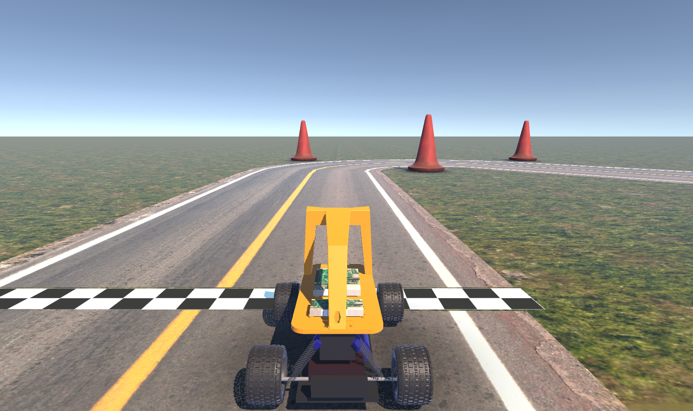
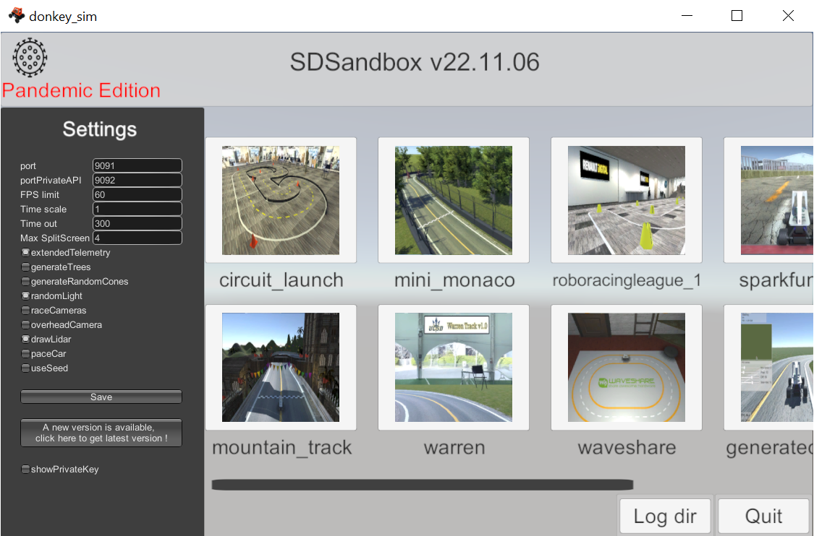

# Autonomous Racing with Reinforcement Learning
The objective of this project is using Reinforcement Learning models and engineering reward functions for the task of autonomous racing around a track. The simulator used is Donkey Car Simulator:



## Results
After training a PPO algorithm (with a custom reward engineered by us) for 600k steps, the car was able to complete laps around the track at a high speed. <br>
A video of the behaviour of the car across the training steps can be found here: <br>
[Video](https://youtu.be/bgBmoeJbTeQ)

The paper in which the details of the project are presented can be found in: <br>
[project_paper.pdf](project_paper.pdf)

## Quick start
In this section there are the necessary steps for the installation, testing and running of the models.
### Installation
To install all the necessary packages, the creation of a virtual environment is recommended . To do so, just execute from a terminal:

```bash
python3 -m venv donkey_env
source donkey_env/bin/activate
```
If you want to exit the venv, just do:
```bash
deactivate
```

To install the packages (it takes quite a while), execute inside the virtual environment:
```
pip install -r requirements.txt
```

Moreover, the simulator interface is needed to be able to run and train models. This interface runs in Unity. <br>
From https://github.com/tawnkramer/gym-donkeycar/releases, download and unzip ``DonkeySimLinux.zip``, ``DonkeySimMac.zip`` or ``DonkeySimWin.zip`` depending on your operating system (and change the permissions when necessary, as stated in the web linked). <br>
To check that the interface has been downloaded properly, open the app, and something similar to the following image should appear:



Note the ``Time scale`` variable in the ``Settings`` block in the left. When training, this variable can be increased (for example to 4), to run simulations faster (for example 4 times faster).

### Variational Autoencoder
In the development of this project, we have seen that using a VAE to encode image observations is much better for the learning process of the model (that's demonstrated in more detail in our [paper](project_paper.pdf)). <br>
The VAE architecture and code that we have used in this project have been obtained from: https://github.com/araffin/aae-train-donkeycar/tree/live-twitch-2 <br>
If you want to use our trained VAEs, you can find them in ``/src/autoencoders/``. For example, you can ``use ae-32_100k.pkl``, which is an autoencoder trained using 100k images thoroughly collected driving the car around the track.


### Organization of the repo
The main folder in this repo is ``src/``. It is a folder created by us, in which we have developed all our code. The ``dependencies/`` folder contains three repositories (mentioned in the [Credits](#credits) section), necessary for our project, and in which we have made only a few modifications. <br>
The contents of the ``src/`` folder are:
- ``autoencoders``: folder with some trained autoencoders and their architecture and auxiliar functions.
- ``center_line``: folder with some center line data and a notebook with the creation of the track sectors used in some rewards explained.
- ``models_test``: folder with one trained model.
- ``vec_envs_test``: folder with one trained vec_env (contains information about the environment after some training steps).
- ``callbacks.py``: file with some callback classes (they are called at every step).
- ``config.yaml``: file with the configuration and hyperparameters used in ``drive.py``. The idea is that any change can be done in this config file, without the need of modifying ``drive.py``.
- ``drive.py``: main file which calls the train or test and auxiliar functions.
- ``rewards.py``: file with the reward functions engineered by us. The last reward (``time_sector_reward``) is the one that has given us the best results.
- ``wrappers.py``: file with some wrapper classes (they modify the behaviour of the environment, for example when taking one step).

### Training a model
**Note**: To train or test a model, the simulator interface has to be open (it looks similar to the image from above). If not, the following error will appear:
```bash
Exception: Could not connect to server. Is it running? If you specified 'remote', then you must start it manually.
```
<br>

To train a model, just run from ``src/``:
```bash
python3 drive.py --train
```
Note that if you want to train a model from scratch, you will have to put the ``load_model`` flag in ``config.yaml`` to False.

### Testing a model
To test a model, just run from ``src/``:

```bash
python3 drive.py 
```

You can find one model in ``/src/models_test/ppo_trained_650k.zip``, which has been trained for 650k steps (and its respective vec env can be found in ``src/vec_envs_test/ppo_trained_650k.pkl``).

## Future Work
The main restriction found in this project was the huge amount of computational power needed to train and run the models, which we didn't have. That's why the scope of the project had to be reduced. <br>
Some work that can be done as a continuation of the project is:
- Using another RL algorithm different from PPO to train the car, such as the SAC, and comparing them to see which one performs better in this environment.
- Training the model for more steps (for example for > 3M steps), to see how (and if) it improves.
- Transferring the learned knowledge into another track, to see if the behaviour learned in a specific track can be generalized to other tracks, or if at least it learns to complete laps faster in other tracks.
- Transferring the knowledge learned in simulation to a real RC car, to see if what has been learned in a simulation can be applied in real life.

## Credits

Related Paper: [Optimizing Autonomous Racing in the Donkey Car Simulator: Novel Reward Functions and Regularization Techniques](project_paper.pdf)

- [DonkeyCar](https://docs.donkeycar.com/): official documentation of the DonkeyCar driving car platform.

- [gym-donkeycar](https://github.com/tawnkramer/gym-donkeycar): GitHub repo of the OpenAI Gym Environments for Donkey Car.

- [stable-baselines3](https://github.com/DLR-RM/stable-baselines3/tree/master): GitHub repo of Stable Baselines3 (SB3), which is a set of reliable implementations of reinforcement learning algorithms in PyTorch.

- [aae-train-donkeycar](https://github.com/araffin/aae-train-donkeycar/tree/master): GitHub repo with the code used to train an augmented auto-encoder (aka denoising auto-encoder with more augmentations) for the DonkeyCar simulator.

- [rl-baselines3-zoo](https://github.com/DLR-RM/rl-baselines3-zoo): GitHub repo of RL Baselines3 Zoo, a training framework for Stable Baselines3 reinforcement learning agents.

- [Part 1](https://www.youtube.com/watch?v=ngK33h00iBE), [Part 2](https://www.youtube.com/watch?v=DUqssFvcSOY&t=15s) and [Part 3](https://www.youtube.com/watch?v=v8j2bpcE4Rg): a series of videos from Antonin Raffin that introduce the DonkeyCar simulator and its training framework.

## How to Cite This Project

If you use this code or the associated paper in your research, please cite this repository. You can use the following BibTeX entry:

```bibtex
@misc{Fugardo2024donkeycarRL,
	author = {Fugardo, Albert},
	title = {{donkeycar-RL: Autonomous Driving with Reinforcement Learning}},
	year = {2024},
	publisher = {GitHub},
	journal = {GitHub repository},
	howpublished = {\url{https://github.com/AlbertFugardo/donkeycar-RL}},
	note = {Accessed on [CURRENT_DATE_OF_ACCESS]. Paper available at \url{https://github.com/AlbertFugardo/donkeycar-RL/blob/main/project_paper.pdf}},
	commit = {88065af66015ae855314b88eae5ae8d17d2a1105}
}
```

Please replace ``[CURRENT_DATE_OF_ACCESS]`` with the date you accessed the repository.